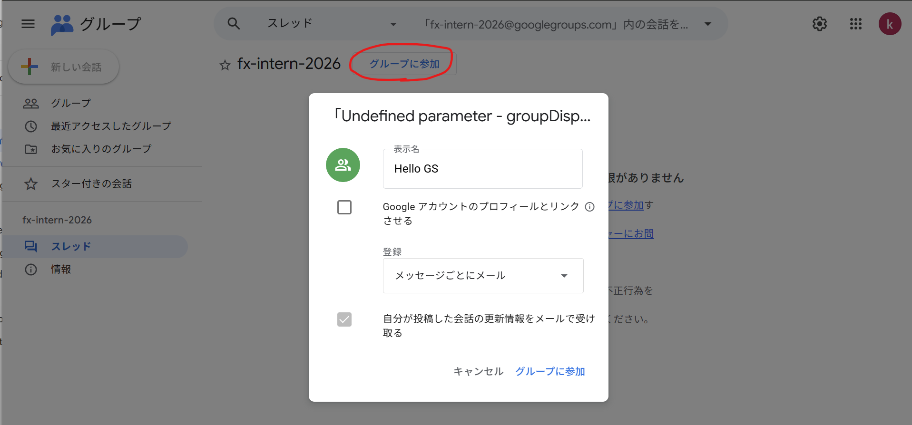
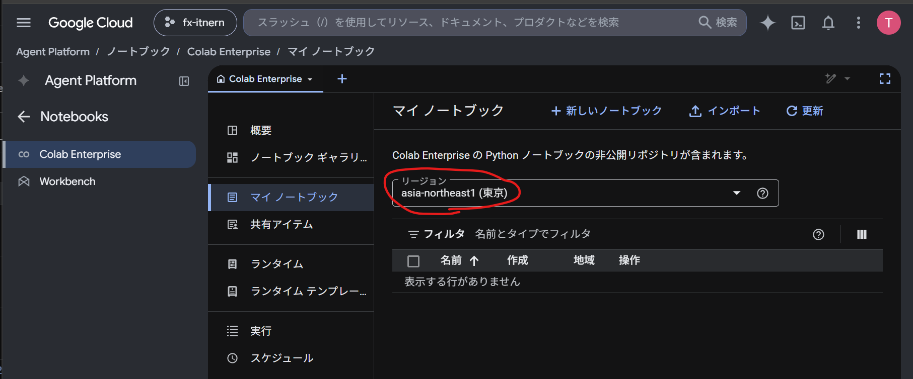
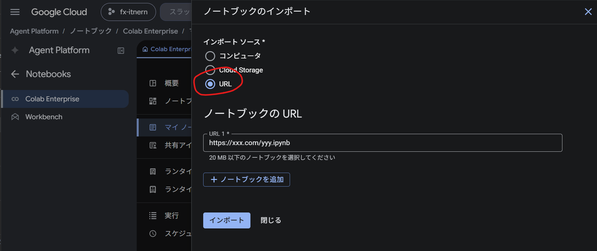
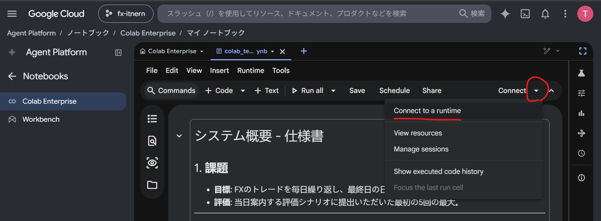
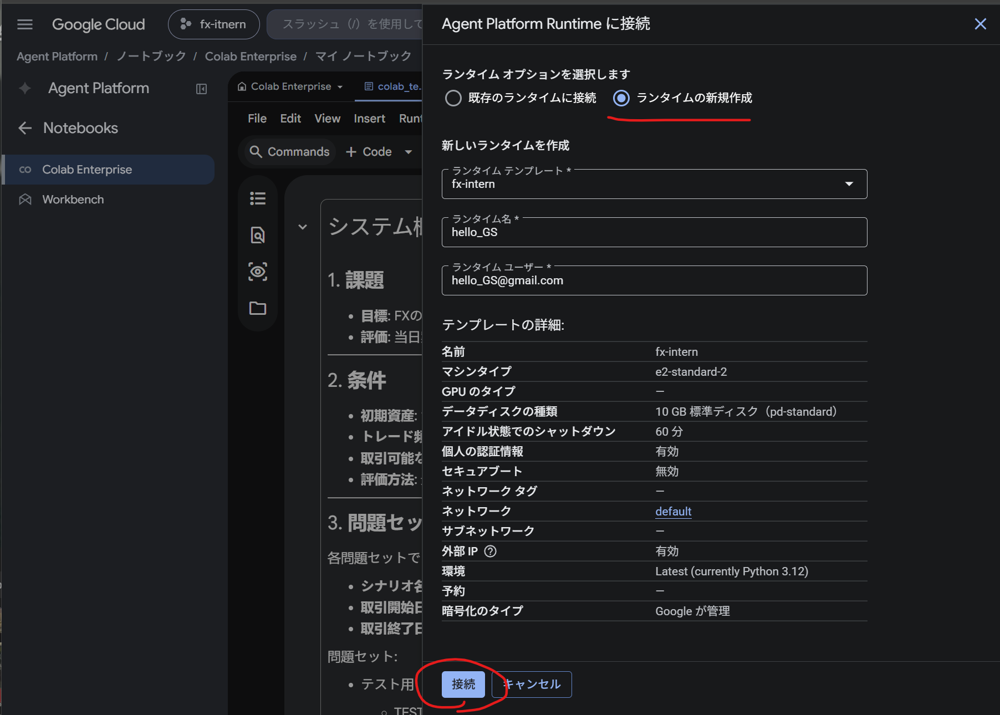

## Colab の使い方

1. 今回のインターン用の [Google Group](https://groups.google.com/g/fx-intern-2026) に参加する。Googleアカウントを所持してない場合は [登録フォーム](https://accounts.google.com/signin) から登録してください。

2. [Colab Enterprise の My notebooks](https://console.cloud.google.com/agent-platform/colab/notebooks?project=fx-itnern) を開き、リージョンに `asia-northeast1` を選択する。

3. **インポート** をクリックし、インポートソース に **URL** を選択して、次の URL を入力してインポートしてください。`TO_BE_UPDATED.ipynb`

4. "Connect" の右側にあるボタンをクリックし、"Connect to a runtime" を選択してください。

5. ランタイムの新規作成を選択し、接続をクリックしてください。

6. 準備は完了です！本インターンではこのノートブック上からコードを実行してください。
